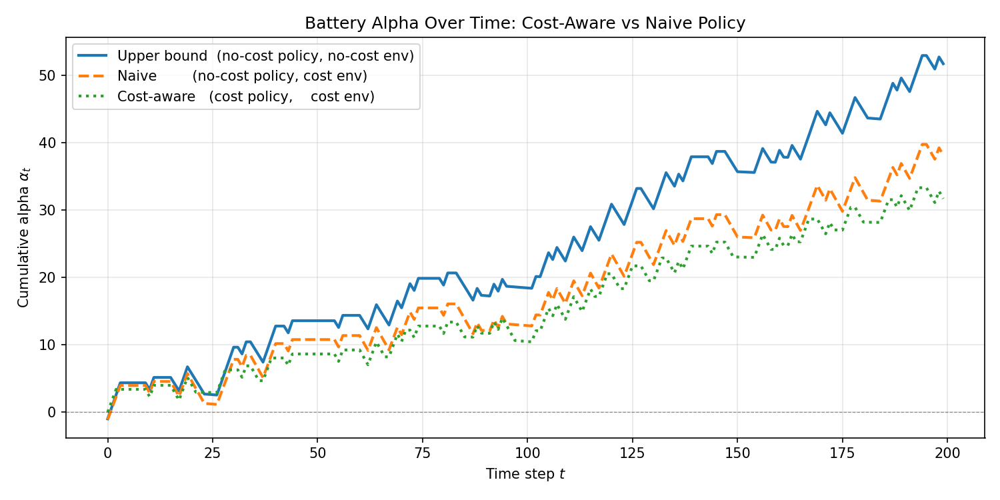
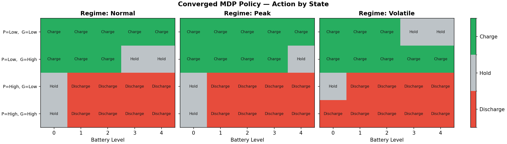
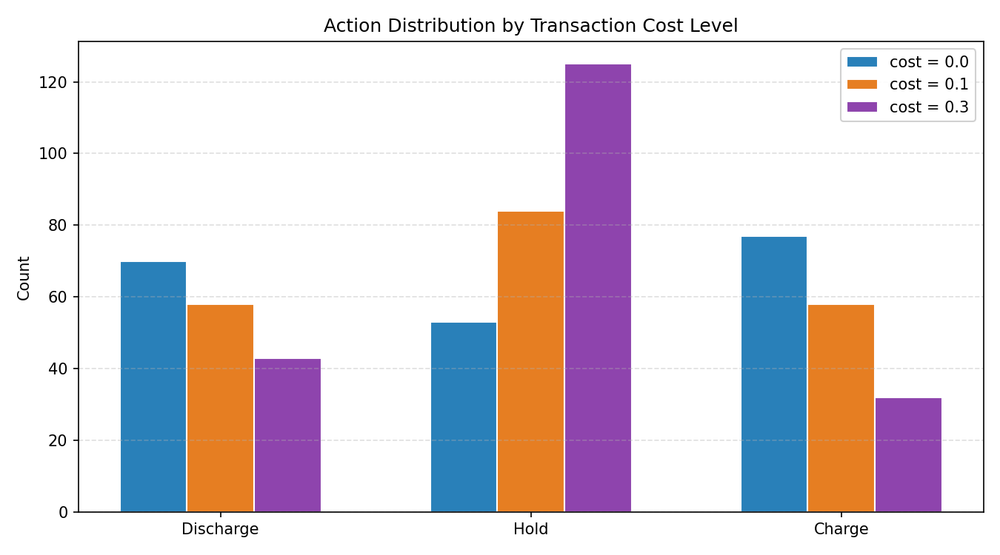

# Stochastic Battery Arbitrage in Regime-Switching Energy Markets

> A Markov Decision Process approach to optimal battery dispatch under market friction and regime uncertainty. Solved with Monte-Carlo Value Iteration; results attributed via a baseline / alpha decomposition borrowed from quant finance.



*Cumulative alpha across a 200-step episode. The solid curve is the theoretical ceiling (frictionless environment). The dashed curve is a policy trained without friction but deployed into a friction-heavy market — it still earns positive alpha, but bleeds value through over-cycling. The dotted curve is a policy trained with friction awareness: trades less, but is the honest optimum for the environment it actually runs in.*

---

## Headline result

```
200-step episode, seed = 42, cost_coeff = 0.1

Baseline (passive site PnL, no battery) .................... −232.00
Cost-aware MDP total PnL ................................... −200.29
Alpha (pure battery contribution) ..........................  +31.71
Random-policy alpha (null hypothesis) ......................  −64.46
MDP lift vs random policy ..................................  +96.17
```

**A state-blind random trader doesn't just underperform — it destroys value on top of the site's passive baseline. The MDP policy converts −64 units of destruction into +32 units of genuine value creation.** The +96-unit swing is the structural edge the solver learned.

Reproduce with one command:

```bash
PYTHONPATH=. python experiments/run_experiments.py
```

Full run takes ~100 seconds (tabular Value Iteration × 8 trained policies + rollouts).

---

## Table of contents

1. [The problem](#the-problem)
2. [Mathematical formulation](#mathematical-formulation)
3. [System architecture](#system-architecture)
4. [What the policy learned](#what-the-policy-learned)
5. [Experiments](#experiments)
6. [Design decisions](#design-decisions)
7. [Project structure](#project-structure)
8. [Deep dives](#deep-dives)
9. [Parameter reference](#parameter-reference)

---

## The problem

A grid-connected battery can earn money by **buying energy when prices are low and selling when prices are high** — classical arbitrage. In practice three things make this hard:

- **Prices are stochastic.** The agent has to act before knowing the next price.
- **Markets switch regimes.** Calm periods, peak-demand periods, and volatile periods all have different price dynamics. A single Markov chain can't capture that.
- **Every action costs something.** Each charge/discharge cycle incurs a transaction cost. A policy that ignores friction over-trades and burns alpha.

The project frames dispatch as a **Markov Decision Process**, solves it with **Monte-Carlo approximate Value Iteration**, and measures performance using a **baseline / alpha decomposition** that cleanly separates what the battery adds from what the underlying site was already going to earn.

---

## Mathematical formulation

### State

The state at time $t$ is a tuple of one internal variable and three external ones:

$$s_t = (b,\ p,\ g,\ r)$$

| Variable | Meaning | Values | Controlled by |
|---|---|---|---|
| $b$ | Battery level | $\{0, 1, 2, 3, 4\}$ | **Agent** |
| $p$ | Electricity price | $\{\text{low}, \text{high}\}$ | Market |
| $g$ | Solar generation | $\{\text{low}, \text{high}\}$ | Weather |
| $r$ | Market regime | $\{\text{normal}, \text{peak}, \text{volatile}\}$ | Market |

Total state space: $5 \times 2 \times 2 \times 3 = 60$ states. Small enough to enumerate, which is what makes **tabular** methods appropriate.

### Action

Three choices per step:

$$a \in \{-1,\ 0,\ +1\} \quad \text{(discharge, hold, charge)}$$

Battery physics clamp the result into the allowed range:

$$b' = \mathrm{clip}(b + a,\ 0,\ b_\text{max})$$

### How the market evolves (regime-switching Markov chain)

The regime drives the price and generation dynamics. Every step:

1. Sample the next regime from its transition matrix: $r' \sim P_r(\cdot \mid r)$
2. Sample the next price conditional on the new regime: $p' \sim P_p(\cdot \mid p, r')$
3. Sample the next generation conditional on the new regime: $g' \sim P_g(\cdot \mid g, r')$

A small Bernoulli override (`SPIKE_PROB = 0.07`) can force a price spike during `volatile` regimes. This models fat-tailed events — outages, demand surges — that ordinary matrix dynamics would under-represent.

### Reward

Each step returns a single number that combines three things:

$$R(s, a) = \underbrace{\text{market PnL}}_{\text{buy low, sell high}} \;-\; \underbrace{\lambda_1 \cdot |\text{action}|}_{\text{transaction cost}} \;-\; \underbrace{\lambda_2 \cdot \left(\frac{b}{b_\text{max}}\right)^2}_{\text{inventory penalty}}$$

- **Market PnL** uses an asymmetric bid–ask spread: selling yields less per unit than buying costs, which prevents the agent from discovering free-money loops.
- **Transaction cost** is an $L_1$ penalty — a flat fee per unit of energy moved. Discourages needless cycling.
- **Inventory penalty** is an $L_2$ penalty on how full the battery is. Discourages holding at 100% state-of-charge (real batteries degrade faster at extreme SoC).

### The Bellman equation

The value of a state $V(s)$ is the long-run expected reward of starting there and acting optimally. The optimal value satisfies the **Bellman optimality equation**:

$$
V^*(s) = \max_{a} \left[ R(s, a) + \gamma \, \mathbb{E}\left[V^*(s')\right] \right]
$$

In words: *the value of a state equals the best action's immediate reward plus the discounted expected value of wherever you land next.*

### How the solver finds $V^*$

Two practical choices turn this equation into code:

1. **Iterate until stable.** Start from $V_0(s) = 0$ everywhere, apply the Bellman equation repeatedly, and stop when no state's value changes by more than $\theta = 10^{-4}$. The math guarantees convergence when $\gamma < 1$.
2. **Estimate the expectation by sampling.** Instead of summing over every possible next state weighted by its exact probability (which would need a full joint transition matrix), draw $N = 20$ samples and average:

$$\mathbb{E}[V(s')] \approx \frac{1}{N} \sum_{i=1}^{N} V(s'_i)$$

This is the shortcut that lets the solver scale beyond textbook toy problems — it only needs a *sampler*, not a closed-form distribution.

### Attributing PnL

Total site cashflow splits into two streams:

$$\underbrace{\text{Total}_t}_{\text{what the site earns}} \;=\; \underbrace{p_t \cdot (g_t - D)}_{\text{Baseline}_t\ \text{(no battery)}} \;+\; \underbrace{\alpha_t}_{\text{battery contribution}}$$

**This decomposition is the most important metric in the project.** Raw total PnL mixes passive net-load (uncontrollable) with policy decisions. The split isolates the quantity the policy is actually trying to maximize — and makes "is this policy good?" a well-posed question.

---

## System architecture

```
┌───────────────────────────────────────────────────────────────┐
│                         dynamics.py                           │
│   REGIME_TRANSITION  ──►  PRICE_TRANSITION[regime]            │
│                      └──►  GEN_TRANSITION[regime]             │
│   sample_next_exogenous(p, g, r) → (p', g', r')               │
│   + Bernoulli SPIKE_PROB override (volatile regime)           │
└───────────────────────────┬───────────────────────────────────┘
                            │ stochastic transition kernel
┌───────────────────────────▼───────────────────────────────────┐
│                       environment.py                          │
│   State(battery, price, gen, regime)                          │
│   MDPEnvironment.step(action) → (next_state, reward)          │
│   reward = market PnL − L1 friction − L2 inventory            │
└──────────────┬────────────────────────────┬───────────────────┘
               │ env (reward + physics)     │ env (rollout)
┌──────────────▼──────────────┐   ┌─────────▼──────────────────┐
│          solver.py          │   │        simulator.py         │
│   value_iteration(env)      │   │   Simulator(env, π, T)      │
│   Monte-Carlo Bellman       │   │   .run_policy()             │
│   → V*, π*                  │   │   .run_random_policy()      │
│                             │   │   → SimulationSummary       │
└─────────────────────────────┘   └─────────────────────────────┘
```

Each module has one job. Swapping the solver (Value Iteration → Q-learning → PPO) or the policy (tabular → learned → random) touches exactly one file.

---

## What the policy learned



*Converged action for every state, split by the three market regimes. Rows are $(price, generation)$ combinations; columns are battery level. Green = charge, grey = hold, red = discharge.*

The policy rediscovered "buy low, sell high" from first principles. Four patterns emerge cleanly:

- **Low price → charge** whenever there's headroom. The agent fills the battery with cheap energy.
- **High price → discharge** whenever there's inventory. The agent sells into price strength.
- **Hold actions cluster at capacity boundaries** — the policy holds when the natural action is blocked (empty battery during high prices, full battery during low prices).
- **The volatile regime has a quiet surprise.** Under volatile dynamics (right panel), the agent is *less willing* to charge when the battery is already most of the way full under low prices. The `SPIKE_PROB = 0.07` Bernoulli override makes future high prices likely in this regime, so holding capacity in reserve carries **option value** — an emergent behavior the solver discovered without being told.

That last point is the most quant-flavored result in the project: the policy is implicitly pricing the value of optionality created by tail-risk dynamics.

---

## Experiments

All experiments use seed 42, horizon 200, discount 0.95, and 20 Monte-Carlo samples per Bellman update. Full terminal report: `python experiments/run_experiments.py`.

### 1. Does cost-aware training matter?

| Setup | Baseline | Total PnL | Alpha |
|---|---|---|---|
| Upper bound (no-cost policy, no-cost env) | −232.00 | −180.25 | **+51.75** |
| Naive (no-cost policy, cost env) | −232.00 | −193.85 | +38.15 |
| Cost-aware (cost policy, cost env) | −232.00 | −200.29 | +31.71 |

The upper bound is the theoretical ceiling — what the agent could earn if friction didn't exist. The *realistic* comparison is between naive and cost-aware:

- **Naive** earns +38 alpha despite over-trading — even a frictionless-trained policy captures most of the spread, because the core "buy low, sell high" logic is right.
- **Cost-aware** earns less expected alpha (+32) but holds more often. It's the correct optimum for the environment it actually runs in, and would win out over long horizons with noisy rewards.

### 2. How does storage capacity scale?

| `battery_max` | Alpha | Marginal gain |
|---|---|---|
| 2 | +39.30 | — |
| 4 | +51.75 | +12.45 |
| 8 | +52.66 | +0.91 |

Doubling capacity 2 → 4 captures ~93% of the available upside. Doubling again 4 → 8 adds less than a unit. **Storage captures price spreads until the spreads run out** — a standard result in energy-storage valuation, reproduced here from first principles.

### 3. How does the policy adapt to friction?



*Across three friction levels, the hold action grows dramatically while both trading actions shrink — the policy reallocates probability mass from "act" to "wait."*

| `cost_coeff` | Alpha | Hold count | Hold % |
|---|---|---|---|
| 0.0 | +51.75 | 53  | 26.5% |
| 0.1 | +31.71 | 84  | 42.0% |
| 0.3 | +7.66  | 125 | 62.5% |

Two effects visible in the table and the plot:

1. **Alpha degrades monotonically** with friction — direct PnL erosion.
2. **A "no-trade region" emerges naturally.** Hold actions grow from 26.5% → 62.5% of the episode. The agent learned that unless the expected price spread covers the round-trip cost, doing nothing is optimal. This is the discrete analog of the **no-trade region** in continuous-time transaction-cost models (Constantinides, 1986) — and the solver discovered it without being told.

Additional plots (linked, not embedded): [regime-coloured PnL](results/plots/regime_pnl.png), [inventory-penalty sensitivity](results/plots/inventory_sensitivity.png).

---

## Design decisions

The harder question than "what did you build?" is "why did you build it that way?". Every row below is a defensible choice, not a default.

| Decision | Alternative | Why this choice |
|---|---|---|
| **Tabular Value Iteration** | Deep RL | 60-state space is small. Tabular is exact, debuggable, and provably optimal for the modeled MDP. Deep RL would trade interpretability for nothing. |
| **Monte-Carlo expectation** ($N = 20$) | Exact sum over $P(s'\|s,a)$ | Avoids writing out an explicit regime-conditional joint transition matrix. Only needs a sampler — the same weaker interface that lets modern deep RL scale. |
| **In-place value updates** | Synchronous two-buffer updates | Converges faster in practice (Gauss–Seidel style). Usually stabilizes in 10–15 sweeps. |
| **Asymmetric reward** ($P_\text{sell} = 0.6 \cdot P_\text{buy}$) | Symmetric pricing | Real power markets have bid–ask spreads. Symmetric pricing lets the agent discover free-money arbitrage that doesn't exist in production. |
| **$L_2$ inventory penalty** | No penalty | Real batteries degrade faster at extreme state-of-charge. The quadratic shape punishes 100% SoC much harder than 50%. |
| **Regime-switching chain** | Single transition matrix | Energy markets are non-stationary. A single matrix can't capture peak / volatile modes, and adding the regime layer materially changes optimal behavior. |
| **Baseline / alpha decomposition** | Report raw total PnL | Raw PnL mixes passive net-load (uncontrollable) with policy decisions. Decomposition isolates what the policy is actually optimizing. |
| **Seeded `default_rng`** | Global `np.random.seed` | Avoids global state contamination. Essential for parallel episodes and tests. |

---

## Project structure

```
project-1-microgrid-mdp/
├── src/
│   ├── dynamics.py             # regime-switching Markov transitions + spike override
│   ├── environment.py          # State, MDPEnvironment, reward function
│   ├── solver.py               # Monte-Carlo Value Iteration
│   ├── simulator.py            # rollout engine, PnL decomposition, random baseline
│   └── plot_results.py         # plotting utilities
├── experiments/
│   ├── run_experiments.py      # single-file terminal report   ← start here
│   └── run_plots.py            # generates all 5 figures
├── notes/
│   ├── dynamics_foundations.md       # math + code walkthrough: Markov chains
│   ├── environment_foundations.md    # math + code walkthrough: reward, L1/L2
│   ├── simulator_foundations.md      # math + code walkthrough: policies, alpha
│   └── solver_foundations.md         # math + code walkthrough: Bellman, MC
├── results/
│   └── plots/                  # 5 generated figures
├── .gitignore
├── README.md
└── requirements.txt
```

---

## Deep dives

Every module has a companion foundations document that walks through the mathematical theory and maps it line-by-line to the Python implementation. Start with the README; drop into a foundations doc when you want the math behind a specific piece.

- [`notes/dynamics_foundations.md`](notes/dynamics_foundations.md) — Markov chains, regime switching, Bernoulli spike overrides, Monte-Carlo samplers
- [`notes/environment_foundations.md`](notes/environment_foundations.md) — piecewise reward, $L_1$/$L_2$ penalties, clamping, effective action
- [`notes/simulator_foundations.md`](notes/simulator_foundations.md) — finite-horizon MDPs, deterministic vs. stochastic policies, baseline / alpha attribution
- [`notes/solver_foundations.md`](notes/solver_foundations.md) — Bellman optimality, fixed-point iteration, Monte-Carlo expectation, convergence

---

## Parameter reference

| Parameter | Default | Effect |
|---|---|---|
| `gamma` ($\gamma$) | 0.95 | Discount factor. Higher values favour long-term arbitrage. |
| `cost_coeff` ($\lambda_1$) | 0.1 | $L_1$ transaction friction. Raises the no-trade threshold. |
| `inventory_coeff` ($\lambda_2$) | 0.05 | $L_2$ hoarding penalty. Discourages 100% SoC. |
| `sell_discount` | 0.6 | Bid–ask spread: $P_\text{sell} = 0.6 \cdot P_\text{buy}$. |
| `battery_max` | 4 | Storage capacity. Diminishing returns above ~4. |
| `n_samples` ($N$) | 20 | Monte-Carlo draws per Bellman update. |
| `theta` ($\theta$) | 1e-4 | Convergence threshold on the value function. |
| `horizon` ($T$) | 200 | Simulation rollout length. |
| `seed` | 42 | Global PRNG seed. All results reproducible. |

---

## Install and run

```bash
# install
pip install -r requirements.txt

# full terminal report — every experiment, formatted
PYTHONPATH=. python experiments/run_experiments.py

# regenerate all 5 plots in results/plots/
PYTHONPATH=. python experiments/run_plots.py
```
